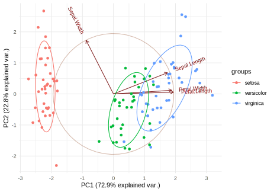
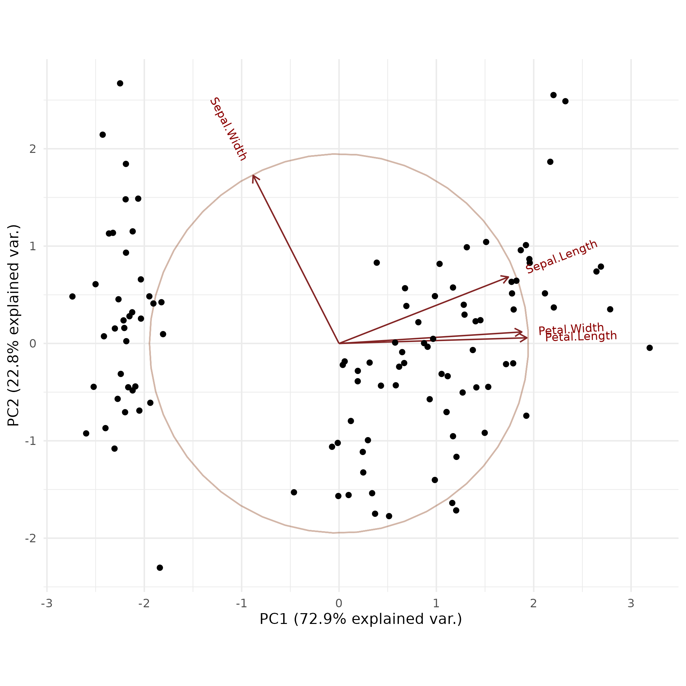

# Investigating the iris dataset

Because the iris dataset does not contain any missing values or other irregularities. We can immediately 
jump to further preprocessing steps. For the full code see ....


## Data preprocessing

We will first split our training set into test and train.


```r
data(iris)
set.seed(123)

# Define the split ratio
split_ratio <- 0.75

# Create training and testing indices
train_indices <- sample(seq_len(nrow(iris)),
                        size = round(split_ratio * nrow(iris)))

# Split the data
train_data <- tibble(iris[train_indices, ])
test_data <- tibble(iris[-train_indices, ])
```
This results in `112` samples in the training set and `38` in the test set.
After cleaning and splittign the data we can now start with the start exploration.

## Data exploration
Because the iris dataset is quite well know I will skip describing the features and what they mean and jump straight into graphical analysis.

We will start with a simple PCA plot

```r
pca_result <- prcomp(train_data %>% dplyr::select(-Species), scale. = TRUE)
biplot <- ggbiplot(pca_result, obs.scale = 1, var.scale = 1, 
         groups = NULL, ellipse = TRUE, circle = TRUE) + theme_minimal()
```





This tells use already that most of the variance is explained by the first principal component or in other words by the a linear combination of the *sepal length*, *petal length* and *petal width*.
This presents us with two choices, we could directly use the PC1 as a predictor or we can use the three featues as predictors separately.


We will use them separately. 
Another way of visualizing the data is with a series ob box plots.
