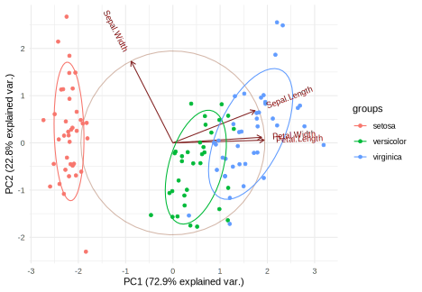

# Investigating the iris dataset

Because the iris dataset does not contain any missing values or other irregularities. We can immediately 
jump to further preprocessing steps. For the full code see ....


## Data preprocessing

We will first split our training set into test and train.


```r
data(iris)
set.seed(123)

# Define the split ratio
split_ratio <- 0.75

# Create training and testing indices
train_indices <- sample(seq_len(nrow(iris)),
                        size = round(split_ratio * nrow(iris)))

# Split the data
train_data <- tibble(iris[train_indices, ])
test_data <- tibble(iris[-train_indices, ])
```
This results in `112` samples in the training set and `38` in the test set.
After cleaning and splitting the data we can now start with the exploration.

## Data exploration
Because the iris dataset is quite well known I will skip describing the features and what they mean and jump straight into graphical analysis.

We will start with a simple PCA plot. An important detail here is the `.scale = TRUE` parameter because without standardization the principal components would be heavily influenced by the scale of the features.

```r
pca_result <- prcomp(train_data %>% dplyr::select(-Species), scale. = TRUE)
biplot <- ggbiplot(pca_result, obs.scale = 1, var.scale = 1, 
         groups = NULL, ellipse = TRUE, circle = TRUE) + theme_minimal()
```



This tells us that most of the variance is explained by the first principal component and that his principal component is mostly driven by the petal features and the sepal length.
Thus we have two choices, we could directly use the PC1 as a predictor or we can use the three features as predictors separately. But first of all let's visualize the features in a another way.


Of the four features given in the dataset we can see tht all except `sepal width` discriminate quite well between the classes. Thus we could decide to build a model based on everything except `sepal width`

## Modeling
In this section we will use two different approaches **Random forest** and **multinomial logistic regression (mnl)**. For each of those approaches we will try out one model that uses all features and one that just uses `petal length`.

### Model construction

R makes it pretty easy to construct multinomial and random forest based models. In another article we will explore building a bayesian classifier on the iris dataset.

```{r}
# Model that uses all four features to predict
model_all <- multinom(Species ~ Sepal.Length + Sepal.Width + Petal.Length + Petal.Width, 
                  data = train_data)

# Model that uses petal lenth
model2_petal <- multinom(Species ~ Petal.Length, 
                  data = train_data)

# Tree based model that uses all features
tree_model_all <- rpart(Species ~ ., data = train_data, method = "class")

# Tree based model that uses petal lengt
tree_model_petal <- rpart(Species ~ Petal.Length, data = train_data, method = "class")
```
Thats it. TODO (Maybe discuss model details, but for that I have to look at the models)

### Model evaluation


#### Looking at the model summaries

```{r}


```

There are different metrics for evaluating the model. In this case we will use the confusion matrix and the accuracy score as the defined by TODO ACCURACY


We can see that the mnl models and the tree model based on all features have the same accuracy while the tree model performs slightly worse.
The confusion matrices tell us that the multinomial models confuse the same amount regardless of using all the features or just the `petal length`. 

 

Actually they have exactly the same predictions. Another interesting aspect is to see what features the decision trees picked.
Thee tree base models performed a little worse


As we can see they both picked the `petal length` as the first split point, while the model that was allowed to pick from all features chose as the `petal width` as a second branch point.
If one compares the box plot of the `petal length`, one can observe that the decision tree basically choose the are between the upper and lower quartiles of the three different classes as branch points.
The same is true for the `petal width` for the first decision tree.


## Summary
We used two different modeling approaches on the iris dataset. The multinomial logistic regression approach quite well, while tree based models performed a little worse. 
It is important to note that, at least the decision trees, are quite sensitive to the random starting seed that influences the training set, and slightly deviate when a different one is chosen. A good reason for a random forest approach.

