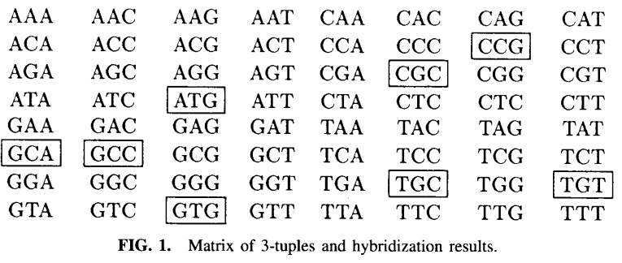
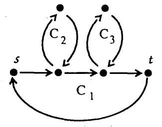

In this post we will look at the paper from M. S. Waterman and R. M. Idury titled "A new algorithm for DNA sequence assembly" which is one of the foundational papers for the usage of deBruijn graphs in genome assembly. We will also try to verify the proposed formulas with own experimental data generated by a self-coded implementation of the proposed algorithm. {# We also provide pictures and examples to make definitions clear #}

> Dislaimer: This is just my personal view on things and there will likely cotain mistakes, still
> I will try to give references to every claim I make regarding topics mentioned in the paper so that
> everybody can check for themselves.

## Introduction and Definitions
Let $a$ be and **DNA-molecule** of length $L$, that it $|a|=L$,  $a$ does consist of multiple shorter subsequences i.e. $a=a_1a_2 \dots a_n$.
The next step then would be to generate reads of this DNA molecule, we denote those reads by $f_1,f_2, \dots, f_n$. Since NGS-reads are pretty short and of equal length we can assume that $|f_i| = l$,  $l << L$. Next we should clarify that all those $f_i$ are contained in $a$, but we don't know the relative order or orientation of
$f_i$, that is, if they are from the ['sense'](https://en.wikipedia.org/wiki/Sense_(molecular_biology)) or "anti-sense' strand, another complecation which arises are so called repeats, for now lets just say that if the length of the repeat region is longer then the length of all fragments $f_i$, then we place the repeat region at the correct place at the genome. One solution to help with those issues is the redundant sequencing of the genome, this is described by the **coverage**, which basically means of often each base in the genome was sequenced. In [2] a formulat is derived for the probability that a single base $b$ is covered by $k$ reads.
{#TODO picture why repeats suck#}

$ \mathbb{P}$(base $b$ is covered by $k$ reads) = $\frac{e^{-c}c^k}{k!} $

Which means that, assuming that reads are uniformly distributed acorss $a$, that the coverage of a given base $b$ is a Possion variable with mean $c$.
Further they showed in [2] that the fraction of $a$ which is covered by at least one read is $1-e^{-c}$.

### The problem with existing methods
Around the time this paper was published the defacto standard method on genome assemly was so calld OLC(Overlap-Consensus-Assembly). It works through the simple observation, that in theory, if on would concatenate all reads based on their overlap to each other one should be able to reconstruct the underlying genome.
{#TODO explaining picture#}. The general outline of all those algorithms is as follows

1. Examine all pairs of reads $(r_i, r_j,)$ and $(r_i, \bar{r}_j)$ for significant overlap; _Overlap_
2.  form an approximate layout of the fragments using the data in (1); _Layout_
3.  make a multiple alignment of the layout from (2) and read $a$ as a consensus sequence from the multiple alignment _Consensus_

One can immediatly see that at least a naive approach to this leads to $O(N^2)$ in step (1), and a pretty expensive multiple alginment step in step (3).
The next problem is that with the rise of NGS(Next-Generation-Sequencing) the amount of reads steadily increases which makes this approach computationally unfeasible.
## Sequencing by hybridization
We will not go into the details of this proposed sequencing technique other than that the idea was to built a matrix of all possibles $k$-mers for a specific $k$ and detect their occurence in the genome, the next figure represents such a matrix for $a=ATGTGCCGCA$. This technique had several shortcomings which are not really relevant for the purpose of this article, so you have to look into paper for more information.{# TODO Ich wuerde das gerne rauslassen #}

  {.center}

In a nutshell we mark an entry in the array in a $k$-mer is a substring of $a$. Further we define the spectrum of $a$ as those $k$-mers wich are marked in the array $spec(a)= \{w : w=a_{i}a_{i+1} \dots a_{i+k-1}, 1 \leq i \leq L - k-1\} $.
We then build a graph $G=(V, E)$ with $V=spec(a)$ and $E=\{(u,v): suffix(u)=prefix(v)\}$. Which means that a $(k-1)$-mer $u$ is joined by a direct edge with a $(k-1)$-mer $v$ if $spec(a)$ contains a $k$-mer which has u has a suffix and v as a prefix. See the next figure for an example on how such a graph would look like.

  {.center}

If we now could find a  path,which visits each edge exactly once, through G then we could recunstruct $a$ from in spectrum $spec(a)$.
Such a path is called an **Eulerian path** and Euler's theorem for directed graphs gives conditions on the existence of such a path. For now define for each vertex $v$

\\[in(v)=|\{u: (u,v) \in E\}|\\]
\\[out(v)=|\{u: (v,u) \in E\}|\\]

Further label the starting vertices $s$ and $t$ respectively, then their exists an eulerian path from $s$ to $t$ if and only ifff

$$
in(v) = out(v) \ \forall v \neq s,t,\\
out(s) - in(s) = 1,\\
out(t) - in(t) = -1.
$$
Since each of those paths refers to DNA sequence, we can infer the sequence unambigioulsy only if the number of Eulerian paths in G is exactly one. The counting of Eulerians paths from $s$ to $t$ can be reduced to the counting of Eulerian Cycles in $G' = (V, E + \{t,s\})$. The addition if $\{t,s\}$ to the set of edges ensures that there exist a Eulerian path iff there exists an Eulerian cycle. We now define the **Intersection Graph** of **G'** 
1. First decompose G' into simple cycles $v_{i_{1}}$ ->  $v_{i_{2}}$ -> $\dots$ ->  $v_{i_{k}}$= $v_{i_{1}}$,  $v_{i}$ $\neq$  $v_{j}$ except for $v_{i_{k}}$= $v_{i_{1}}$. An edge can be used in at most on cycle $C_i$.
2. For these $C_i$ define$ G_{int}$ = ($V=\{C_1$, $C_2$, $\dots$, $C_n$}, E}. If cycles $C_i$ and $C_j$ have $l$ vertices in common, connect them by $l$ edges in $G_{int}$.

For the $G'$ the simple cycles look like this.
 {.center}

And $G_{int}$ looks like this.
 {.center}
This is a tree since it is connected and acyclic. The following theorem from [1] gibes the necessary conditions for finding a unqie Eulerian cycle in a graph $G$

**Theorem 1** (Pevzner, 1989). There is a unique Eulerian cycle in G if and only if the intersection graph $G_{int}$ of simple cycles from G is a tree. 

## A new algorithm for shotgun sequencing 

## The sequence graph
We now define the so called **sequence graph** $G=(V,E)$ on the set of reads $R$, with $V$ =$ \{v|\exists r \in R, i \in \mathbb{N}, v = a^{r}_{i},  \dots a^r_{i+k-2} \lor v = a^{r}_{i+1},  \dots a^r_{i-k-1}  \} $ i.e. $v$ equals a prefix or suffix of a substrig of an $r \in R$ we let $tup(v)$ denote the corresponding tuple in $r$ and $E=$ {#TODO#}.
By this definition an edge corresponds to a k-mer, while elements of V correspond to (k-1)-mers.
We now provide further definitions which we later use in the text.

**Definition 1** Occurence of an edge. Let $occ(e) denote the set of all regions (of length >= k) of reads contained in $tup(e)$
**Definition 2** Weight of an edge.

**Definition 3** Incoming edges of a vetice

**Definition 4** Outgoing edges of a vetice

**Definition 5** Begin of an edge

**Definition 6** End of an edge

{# TODO bild #}
## Structure of the sequence graph
Let $G=(V,E)$ be a graph.

**Definition 7** Singleton. A singleton is a vertex whose indegree and outdegree are at most one each i.e. 

$v \in V$ singleton $\iff deg_{in}(v) \leq 1 \land deg_{out} \leq 1$
<!--- 
TODO: add picture 
-->
**Definition 8** Fork. A fork is a vertex for which one of indegree or outdegree is at most one, the other is more then one i.e. 

$v \in V$ fork $\iff deg_{in}(v) \leq 1  \implies deg_{out}(v) \geq 1$ or $deg_{out}(v) \leq 1  \implies deg_{out}(v) \geq 1$  
<!--- 
TODO: add picture 
-->

**Definition 9** Cross. A cross is a vertex for which both indegree and outdegree are more then one i.e. 

$v \in V$ cross $\iff deg_{in}(v) \geq 1 \land deg{out}(v) \geq 1$
<!--- 
TODO: add picture 
-->

The authors now make a few assumptions to simplify the mathematical analysis of the sequence graph.
1. Errors are uniformly distributed both over all reads, and over the entire length of the read
2. The error rate is small.
3. For any position $i$ of the genome $g$ the number of fragments covering the region $i \dots i+k-2$ is a poisson radom variable
<!--- 
TODO: Add explanation
-->
4. There are no repeats of length $k$ or greater in $g$
<!--- 
TODO: Add explanation
Because otherwise the genome is not recoverable; pretty heavy assumptiom
-->
5. The only sequencing errors are substitution errors

They further define the following symbols  
k = Length of k-mer  
L = Length of the original genome  
N = Number of reads  
l = average length of each read  
c = mean depth of coverage i.e. mean of how often a base was sequenced  
T = Number of (k-1)bp regions i.e.how many kmers there are, keep in mind that duplicates are counted multiple times here.  
 ($|r_1|+|r_2|+\dots+|r_N|-(k-2)N=N(l-k+2)$)
<!--- 
TODO: Add explanation
-->
r = Error rate 
<!--- 
TODO: Add explanation
Is that the chance that a base was substituted with a different one
-->

**Theorem 2** Let $L'=L-l+2$ and $R=(1-1-r)^{k-1}$. Then, in a sequence graph:

1. The expected number of vertices $\mathbb{E}(|V|)=RT+(1-e^{-c(1-R)})L'$.
1. The expected number of singletons $\mathbb{E}(|V|)=RT+e^{-c(1-R)}(e^{c(1-R)(1-r)^2}+c(1-R)r(2-r)-1)L'$.

## Experimental validaton

### Verification of the papers results

## Simplyfication of the sequence graph
### Elimination of singletons
In this step the authors elimate all vertices which just have one incoming and one outgoint edge. As mentioned in the paper this can result 
in graph size reduction of up tp 90%.
Let now $v$ be the vertex we are looking at and $e_1=(u,v)$, $e_2=(v,w)$ the incoming and outgoing edge respectively. The next step is then to replace $e1$ and $e2$ with a new edge $e_3=(u,w)$ in the following way.
<!--- Picture of what is happening -->
### Elimination of forks
### Elimination of crosses
### Irreducible sequence graphs
## Outlook for the next post(EULER-assembler)
## Proofs

http://cs.brown.edu/courses/csci1820/resources/Idury_Waterman_1995.pdf

[bibtexify visualization=false]
% 2684223 
@Article{pmid2684223,
   Author="Pevzner, P. A. ",
   Title="{1-{T}uple {D}{N}{A} sequencing: computer analysis}",
   Journal="J Biomol Struct Dyn",
   Year="1989",
   Volume="7",
   Number="1",
   Pages="63--73",
   Month="Aug"
}

@article{LANDER1988231,
title = {Genomic mapping by fingerprinting random clones: A mathematical analysis},
journal = {Genomics},
volume = {2},
number = {3},
pages = {231-239},
year = {1988},
issn = {0888-7543},
doi = {https://doi.org/10.1016/0888-7543(88)90007-9},
url = {https://www.sciencedirect.com/science/article/pii/0888754388900079},
author = {Eric S. Lander and Michael S. Waterman},
abstract = {Results from physical mapping projects have recently been reported for the genomes of Escherichia coli, Saccharomyces cerevisiae, and Caenorhabditis elegans, and similar projects are currently being planned for other organisms. In such projects, the physical map is assembled by first “fingerprinting” a large number of clones chosen at random from a recombinant library and then inferring overlaps between clones with sufficiently similar fingerprints. Although the basic approach is the same, there are many possible choices for the fingerprint used to characterize the clones and the rules for declaring overlap. In this paper, we derive simple formulas showing how the progress of a physical mapping project is affected by the nature of the fingerprinting scheme. Using these formulas, we discuss the analytic considerations involved in selecting an appropriate fingerprinting scheme for a particular project.}
}
[/bibtexify]
